# Illustrations...


# Initial Step

**First, We need to start the database and the app.**

current state of database (after initial creation):

Follow Steps 15 to 18 from [notes](./notes.txt) to view `appusers` table.

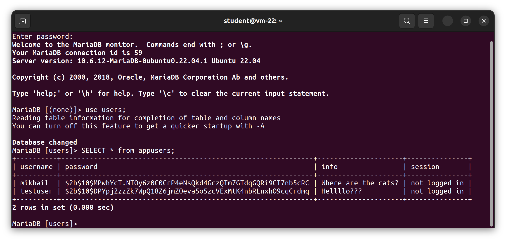

```shell
cd sqlibasic/
node sessions.js
```

Visit https://localhost:3000/

Click `Advanced`

Click `Accept the Risk and Continue`

Click `Create account.`


## That multiple users can create an account.

Create Two Accounts

Account 1 Details (use chrome client)

```
username: daisy
password: A2345678b+
info: The sky is blue
```

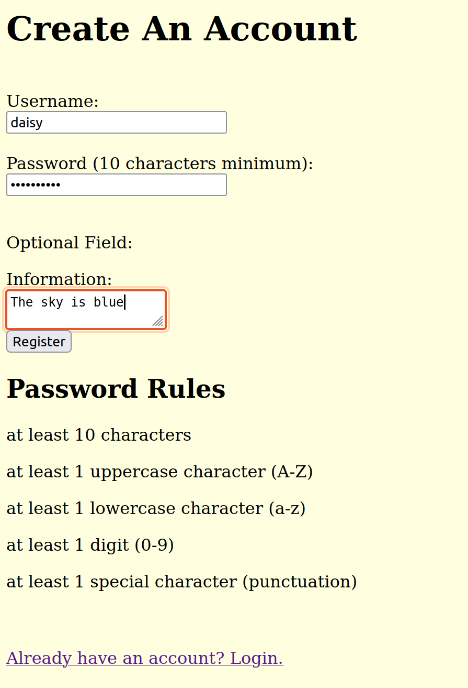

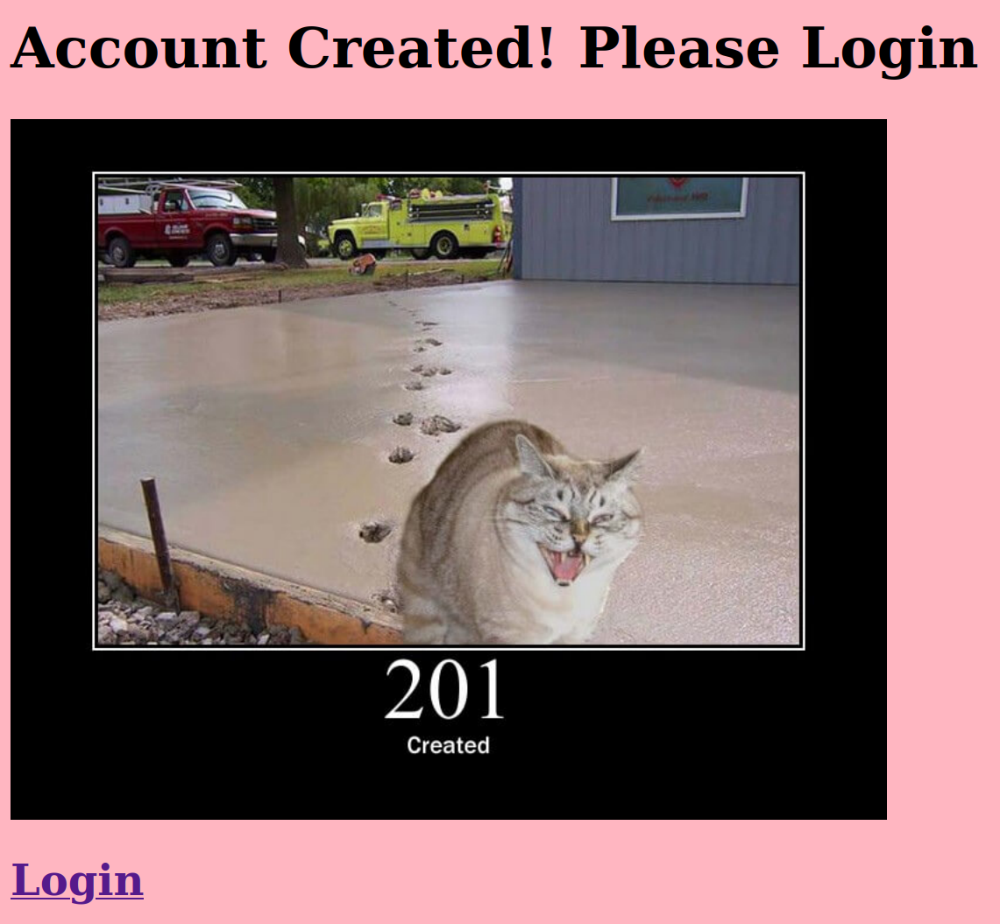

Account 2 Details (use Firefox client)

```
username: john
password: Bpd2*09w_P
info: I need to go to the store.
```

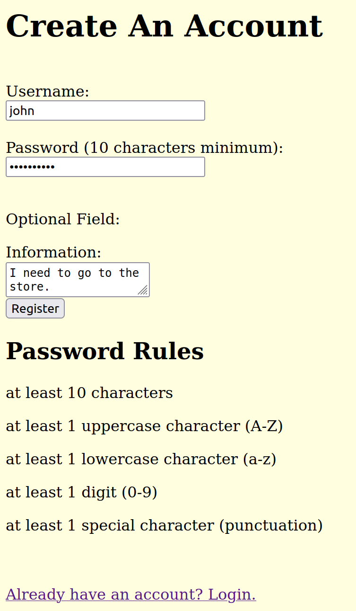


```mariadb
SELECT * from appusers;
```

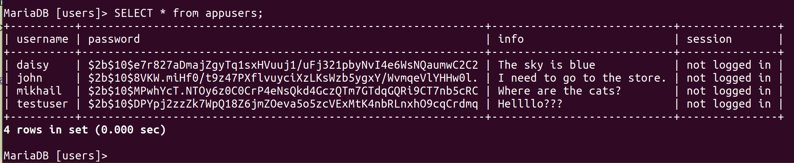


## That multiple users can login and correct information is shown upon login/visiting the website with a valid session.


Login Two Accounts

Account 1 Details (use chrome client)

```
username: daisy
password: A2345678b+
```

Account 2 Details (use Firefox client)

```
username: john
password: Bpd2*09w_P
```

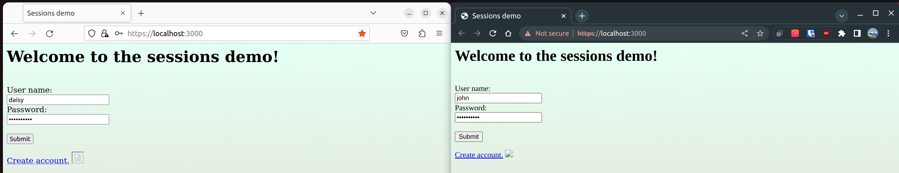

Press `submit`

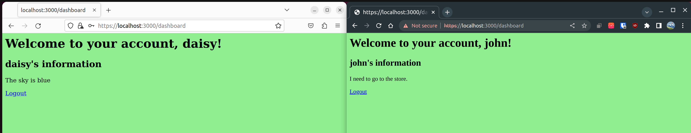

current state of database, after multiple account login:

```mariadb
SELECT * from appusers;
```

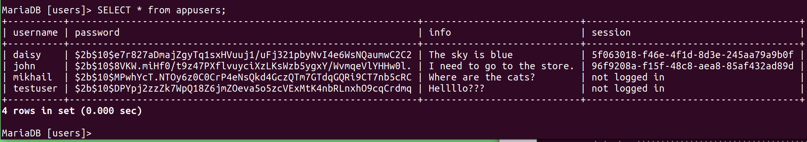


## That user's can logout and after logout the user is directed to login if they visit the site.

Press `Logout` on both `daisy` and `john` accounts. Page should redirect after pressing `Logout`.

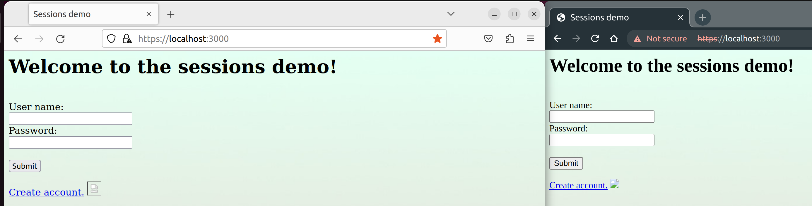

current state of database, after multiple account Logout:

```mariadb
SELECT * from appusers;
```

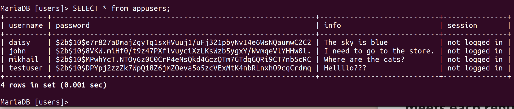

## An explanation and screenshots explaining how the code meets each requirement.
### Step 1. Add a "session" attribute to the appusers table.

Please look at step 11 in [notes](/notes.txt)

This is what `appusers` should look like:

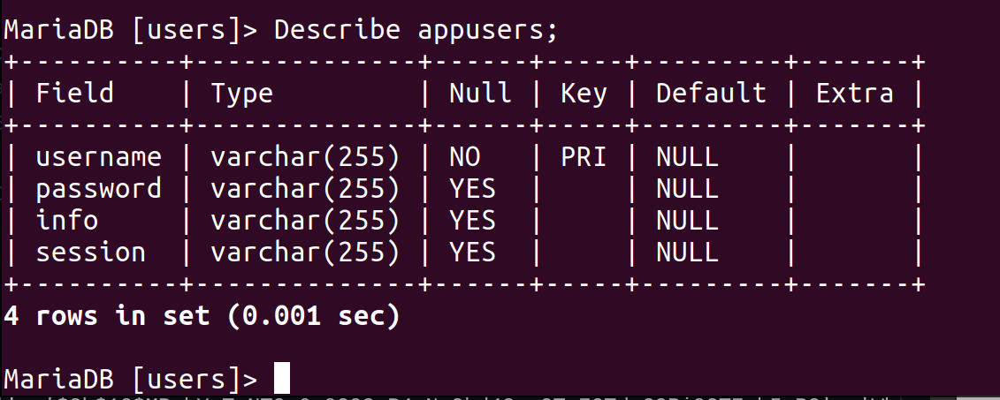


### Step 7. Add a self-signed HTTPs certificate.

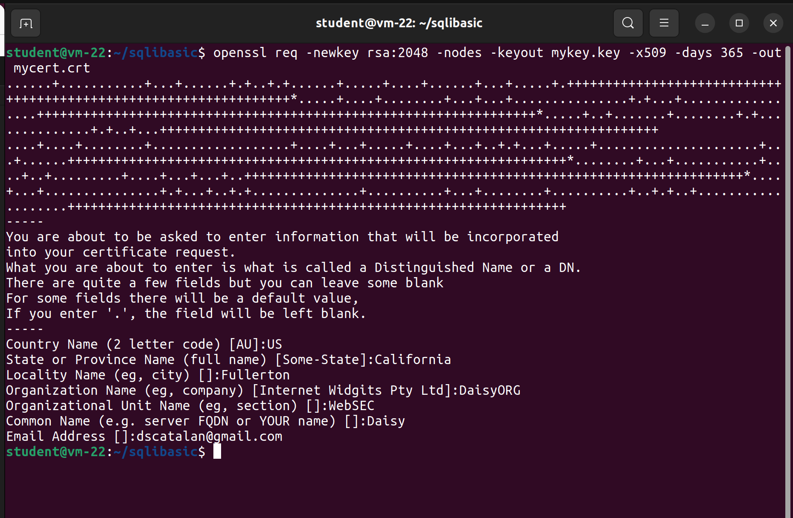

```shell
cd sqlibasic/

openssl req -newkey rsa:2048 -nodes -keyout mykey.key -x509 -days 365 -out mycert.crt
```

```shell
US
California
Fullerton
DaisyORG
WebSEC
Daisy
dscatalan@gmail.com
```

