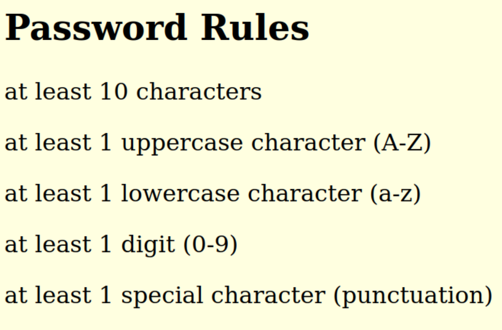

# Illustrations

## Initial Step

**First, We need to start the database and the app.**

current state of database (after [initial database setup](./notes.txt)):

To view `appusers` table, follow Steps `15` to `18` from [notes](./notes.txt).


```shell
cd sqlibasic/
node sessions.js
```

Visit https://localhost:3000/

Click `Advanced`

Click `Accept the Risk and Continue`

Click `Create account.`


## That multiple users can create an account.

Create Two Accounts

Account 1 Details (use chrome client)

```
username: daisy
password: A2345678b+
info: The sky is blue
```


Account 2 Details (use Firefox client)

```
username: john
password: Bpd2*09w_P
info: I need to go to the store.
```


```mariadb
SELECT * from appusers;
```


## That multiple users can login and correct information is shown upon login/visiting the website with a valid session.


Login Two Accounts

Account 1 Details (use chrome client)

```
username: daisy
password: A2345678b+
```

Account 2 Details (use Firefox client)

```
username: john
password: Bpd2*09w_P
```


Press `submit`


current state of database, after multiple account login:

```mariadb
SELECT * from appusers;
```


## That user's can logout and after logout the user is directed to login if they visit the site.

Press `Logout` on both `daisy` and `john` accounts. Page should redirect after pressing `Logout`.


current state of database, after multiple account Logout:

```mariadb
SELECT * from appusers;
```


## An explanation and screenshots explaining how the code meets each requirement.
### Step 1. Add a "session" attribute to the appusers table.

Please look at step 11 in [notes](/notes.txt)

This is what `appusers` should look like:


### Step 2. When the user logs in, store the session ID in the "session" attribute of the user's record. Please do not make any other changes to the database.

Please look at `/login` POST endpoint for code in `sessions.js`.

The most important piece of code is within:

```javascript
		if (match) {

			// create random id and store in cookie
			req.session.id = uuidv4()
			console.log("req.session.id: ", req.session.id)

			//store in db
			let query = "USE users; UPDATE appusers SET `session`=?  WHERE `username`=?";
			console.log(query);

			mysqlConn.query(query, [req.session.id, userName],function (err, res) {
				if (err) throw err;

				console.log(res[1]['message'])
			})


			res.redirect('/dashboard');
		}
		else {
			// If no matches have been found, we are done
			res.send("<b>Wrong</b>");
		}
```

### Step 4. When the user logs out, the session ID is deleted from the user's record (or is replaced with some place holder value such as "not logged in".

Please look at `/logout` GET endpoint for code in `sessions.js`.

The most important piece of code is within:

```javascript
	// clear session id from db
	let message = "not logged in"
	let query = "USE users; UPDATE appusers SET `session`=?  WHERE `session`=? ";
	console.log(query);

	mysqlConn.query(query, [message, req.session.id],function (err, res) {
		if (err) throw err;

		console.log(res[1]['message'])
	})	
```


### Step 5. Add an option to allow users to register (i.e., add their user name and password)

Please look at `/create-account` endpoints for code in `sessions.js`.

The most important piece of code is within `/create-account`POST endpoint:

```javascript
// Get the username and password data from the form
	let userName = req.body.username;
	let password = req.body.password;

	console.log("req.body.information: ", req.body.information);
	
	let initialInfo = req.body.information;

	let initialSession = "not logged in"

	bcrypt.hash(password, saltRounds, function (err, hash) {
		// Store hash in your password DB

		// Construct the query
		let query = "USE users; INSERT INTO appusers (`username`, `password`, `info`, `session`) VALUES (?, ?, ?, ?)";
		

		mysqlConn.query(query, [userName, hash, initialInfo, initialSession], function (err, qResult) {
console.log(query);
			if (err) throw err;

			console.log(qResult[1]);

			res.redirect('/successpage');

		});
	})
```


Also take a look at the created views: `create-account-page.ejs`, `successpage.ejs` within `views/` folder.


Here is `create-account-page.ejs` :

```ejs
<html>
<title> Sessions demo </title>

<body bgcolor="lightyellow">
  <h1>Create An Account</h1>
  <br>

  <div>
    <form action="/create-account" method="POST">
      <label for="username">Username:</label><br>
      <input type="text" id="username" name="username"><br><br>
      <label for="pass">Password (10 characters minimum):</label><br>
      <input type="password" id="pass" name="password" minlength="10" required><br><br>
      
      <p>Optional Field:</p>
      <label for="information">Information:</label><br>
      <textarea name="information" placeholder='Enter information...' maxlength='1000'></textarea>
      <br>
      <input type="submit" value="Register">
    </form>

    <div>
      <h2>Password Rules</h2>
      <p>at least 10 characters</p>
      <p>at least 1 uppercase character (A-Z)</p>
      <p>at least 1 lowercase character (a-z)</p>
      <p>at least 1 digit (0-9)</p>
      <p>at least 1 special character (punctuation) </p>
      
      
    </div>

    <br><br>

    <a href="/">Already have an account? Login.</a>


</body>

</html>
```


Here is `successpage.ejs`. This page will render if account creations is successful.

```ejs
<html>
<body bgcolor="lightpink">

<h1> Account Created! Please Login</h1>
<div>
</img>
</div>

<h2><a href="/"> Login</a></h2>

</body>
</html>
```

### Step 5. Use the node.js's [bcrypt](https://www.npmjs.com/package/bcrypt) package to securely store and verify passwords (in the SQL dabatabse). You can also find a very simple sample [file here](https://csufullerton.instructure.com/courses/3356207/files/234757175?wrap=1).

see the previous code snipping for storing passwords using bcrypt.

To verify, see `/login` POST endpoint. Below is a snippet showing the usage of bcrypt to verify passwords.

```javascript
const hash = bcrypt.hashSync(password, saltRounds);
let passHashComparison = bcrypt.compareSync(password, hash);
console.log("passHashComparison: ", passHashComparison);

// use username comparison and passHashComparison to evaluate if match is found
```


### Step 6. Use node.js's [password strength checker package](https://www.npmjs.com/package/check-password-strength) to check whether the user's password is strong according to OWASP 10 requirements covered in class.

add middleware right before `/create-account` POST endpoint.

```javascript
// middleware: check-password-strength
app.use("/create-account", (req, res, next) => {
	console.log("middleware: checking password strength...");
	console.log("Password:", passwordStrength(req.body.password).value);
	console.log("Password:", passwordStrength(req.body.password).length);
	console.log("Password:", passwordStrength(req.body.password).contains);

	if (passwordStrength(req.body.password).value === "Strong") {
		next();
	} else {
		res.send("Password Not Strong Enough! Please make sure to satisfy all password rules!");
	}
});
```


Password rules are listed on `create-account-page.ejs`



### Step 7. Add a self-signed HTTPs certificate.


```shell
cd sqlibasic/

openssl req -newkey rsa:2048 -nodes -keyout mykey.key -x509 -days 365 -out mycert.crt
```

```shell
US
California
Fullerton
DaisyORG
WebSEC
Daisy
dscatalan@gmail.com
```


### Step 8. Configure the [client-sessions](https://www.npmjs.com/package/client-sessions) package to have the session expire after 10 mins inactivity (which the program already uses).

```javascript
// The session settings middleware	
app.use(sessions({
	cookieName: 'session',
	secret: 'random_string_goes_here',
	duration: 10 * 60 * 1000, // 10 mins
	activeDuration: 10 * 60 * 1000, // 10 mins
	cookie: {
		httpOnly: true // when true, cookie is not accessible from javascript
	}
}));
```

### Step 9. Add CSP protection and make session cookies HTTPOnly to ensure some protection against XSS.

Add CSP protection

```javascript
// csp middleware
app.use(
	contentSecurityPolicy({
		useDefaults: true,
		directives: {
			defaultSrc: ["'self'"],
			scriptSrc: ["'self'"],
			imgSrc: ["'self'", 'data:', 'http.cat'],
			objectSrc: ["'none'"],
			upgradeInsecureRequests: [],
		},
		reportOnly: false,
	})
);
```


In the default page ("/") I have an image that should not load, and in create-account I have an image that should load.


This is because the image source is not allowed because I did not list it within the csp middleware.


I did list `http.cat` , so the cat image should work in the `successpage.ejs` page.


In Step 8, `httpOnly` is set to true when setting up the `client-sessions` cookie.


### Step 10. Make sure that the webapp has a privilege-restricted database account.

See Step `13` from [notes](./notes.txt).

Code snippet from `sessions.js` showing use of privilege-restricted database account.

```javascript
// Connect to the database
const mysqlConn = mysql.createConnection({
	host: "localhost",
	user: "appaccount",
	password: "apppass",
	multipleStatements: true

});
```
